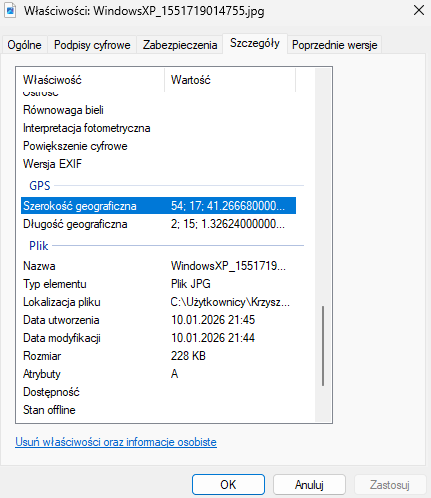
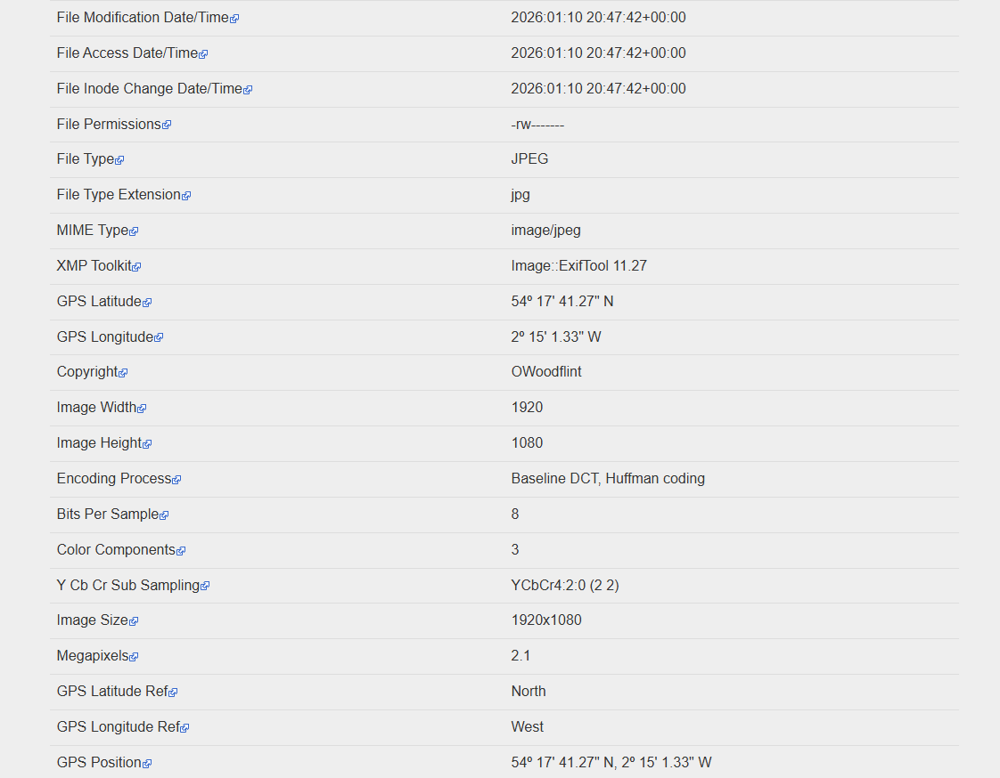
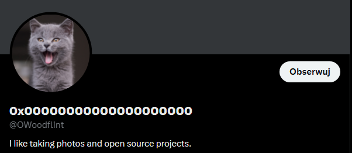
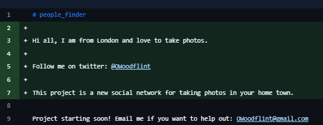
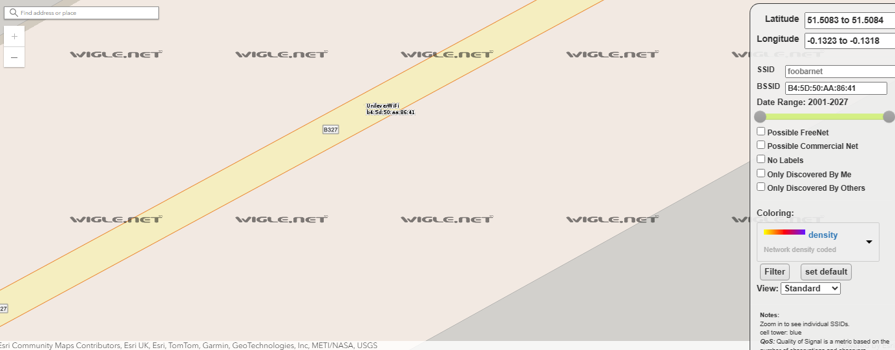

# OhSINT – OSINT Investigation Lab

## 🎯 Objective

The goal of this lab was to gather publicly available information about a target user using OSINT techniques and answer a set of predefined questions.

---

## ❓ Questions

- What is this user's avatar of?
- What city is this person in?
- What is the SSID of the WAP he connected to?
- What is his personal email address?
- What site did you find his email address on?
- Where has he gone on holiday?
- What is the person's password?

---

## 📂 Initial Files

The challenge provided a single image file:


This image became the starting point for the entire investigation.

---

## 🔍 Metadata Analysis (EXIF)

The first step was to analyze the image metadata.  


I checked the file properties locally and then used **exif.tools** to extract full EXIF data.

Key findings:

```
File Name: phpQKiRXU
Copyright: OWoodflint
GPS Latitude: 54º 17' 41.27" N
GPS Longitude: 2º 15' 1.33" W
GPS Position: 54º 17' 41.27" N, 2º 15' 1.33" W
```

The most important discovery here was the **author name: OWoodflint**, which became the primary OSINT pivot.

---

## 🌐 Online Presence Enumeration

Using the username **OWoodflint**, I searched for accounts across multiple platforms.


Discovered profiles:

- WordPress: oliverwoodflint.wordpress.com
- GitHub: https://github.com/OWoodfl1nt
- X (Twitter): https://x.com/OWoodflint

---

## 🖼️ Avatar Identification

I checked profile avatars across the discovered platforms:

- WordPress – no avatar
- GitHub – no avatar
- X – profile picture shows a **cat**



**Answer:**  
**What is this user's avatar of?**  
➡️ Cat ✅

---

## 🌍 Location Identification

The next task was to determine the city the person is in.

- On WordPress, I found a post mentioning:
  > "I'm in New York right now"

This suggested temporary travel rather than permanent residence.

To verify the actual city, I moved to GitHub and inspected the repository **people_finder**.  
I checked the commit history of `README.md`.

In commit `9d4259e`, I found the following line:



```
Hi all, I am from London and love to take photos.
```

**Answer:**  
**What city is this person in?**  
➡️ London ✅

---

## 📡 Wireless Network (SSID)

A post on X contained the following information:

```
From my house I can get free wifi ;D
BSSID: B4:5D:50:AA:86:41 - Go nuts!
```

Using the BSSID, I searched the **WiGLE (Wireless Geographic Logging Engine)** database to identify the wireless network name.



**Answer:**  
**What is the SSID of the WAP he connected to?**  
➡️ UnileverWiFi ✅

---

## 📧 Email Address Discovery

While reviewing the same GitHub commit history, I found an email address included in a project description:

```
Project starting soon! Email me if you want to help out: OWoodflint@gmail.com
```

**Answers:**

- **What is his personal email address?**  
  ➡️ OWoodflint@gmail.com ✅
- **What site did you find his email address on?**  
  ➡️ GitHub ✅

---

## ✈️ Holiday Location

Earlier research revealed that the user mentioned being in **New York** on his WordPress blog.

**Answer:**  
**Where has he gone on holiday?**  
➡️ New York ✅

---

## 🔑 Password Discovery

The final task was to identify the user's password.

- GitHub did not reveal any password information
- I returned to the WordPress site for deeper inspection
- I analyzed the page source and visual layout

During closer inspection, I discovered **hidden text** written in white font on a white background.

    ```
    <p style="color:#ffffff;" class="has-text-color">pennYDr0pper.!</p>
    ```

The revealed password was:

```
pennYDr0pper.!
```

**Answer:**  
**What is the person's password?**  
➡️ pennYDr0pper.! ✅

---

## 🧰 Tools & Resources Used

During this lab, the following tools and resources were used:

### 🛠️ Tools

- **Exif.tools** – extraction and analysis of image metadata (GPS, author, EXIF data)
- **GitHub** – commit history analysis and repository enumeration
- **WordPress** – content review and source code inspection
- **WiGLE (Wireless Geographic Logging Engine)** – identification of wireless networks using BSSID
- **Wayback Machine (Internet Archive)** – historical analysis of archived web content
- **Web Browser DevTools** – inspection of page source and hidden HTML elements

### 🔍 Techniques

- Open Source Intelligence (OSINT)
- Metadata analysis
- Username pivoting
- Commit history investigation
- Social media reconnaissance
- Hidden content discovery (CSS / HTML inspection)

## 📌 Skills Demonstrated

- OSINT investigation
- Analytical thinking
- Data correlation
- Attention to detail
- Security awareness

---

## 🧠 Lessons Learned

- Image metadata can reveal valuable OSINT pivots
- Commit history is often more valuable than repository content
- Social media oversharing can expose sensitive information
- Hidden content on websites is a common OPSEC failure
- OSINT requires patience and correlating multiple small clues
